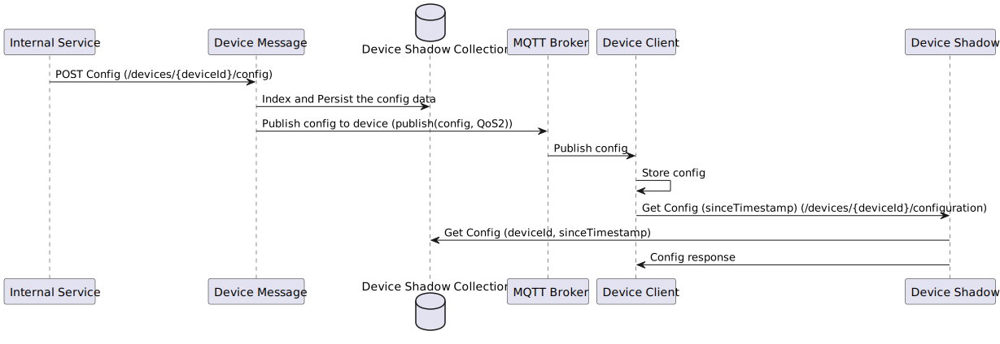

<div align="center">
  
</div>

# Device Shadow

[](https://github.com/eclipse-ecsp/device-shadow/actions/workflows/maven-build.yml)
[](https://sonarcloud.io/summary/new_code?id=eclipse-ecsp_device-shadow)
[](https://sonarcloud.io/summary/new_code?id=eclipse-ecsp_device-shadow)
[](https://github.com/eclipse-ecsp/device-shadow/actions/workflows/licence-compliance.yaml)
[](https://github.com/eclipse-ecsp/device-shadow/releases)

Device-shadow component is responsible to provide ability to device to resync its configuration, especially when the device got disconnected or its configuration is found to be corrupted.

# Table of Contents
* [Getting Started](#getting-started)
* [Architecture](#architecture)
* [Usage](#usage)
* [How to contribute](#how-to-contribute)
* [Built with Dependencies](#built-with-dependencies)
* [Code of Conduct](#code-of-conduct)
* [Contributors](#contributors)
* [Security Contact Information](#security-contact-information)
* [Support](#support)
* [Troubleshooting](#troubleshooting)
* [License](#license)
* [Announcements](#announcements)
* [Acknowledgments](#acknowledgments)


## Getting Started

Device Shadow component exposes API that the Device Client can use to resync its configuration, especially when it got disconnected or its configuration is found to be corrupted.

To build the project in the local working directory after the project has been cloned/forked, run:

```mvn clean install```

from the command line interface.

### Prerequisites

The list of tools required to build and run the project:
   - Java 17
   - Maven
   - Container environment

### Installation

[Install Java 17](https://www.azul.com/downloads/?version=java-17-lts&package=jdk#zulu)

[How to set up Maven](https://maven.apache.org/install.html)

Install [Docker Desktop](https://www.docker.com/products/docker-desktop/) / [Podman](https://podman.io/)


### Coding style check configuration

[checkstyle.xml](./checkstyle.xml) is the coding standard to follow while writing new/updating existing
code.

Checkstyle plugin [maven-checkstyle-plugin:3.2.1](https://maven.apache.org/plugins/maven-checkstyle-plugin/) is
integrated in [pom.xml](./pom.xml) which runs in the `validate` phase and `check` goal of the maven lifecycle and fails
the build if there are any checkstyle errors in the project.

To run checkstyle plugin explicitly, run the following command:
```mvn checkstyle:check```

### Running the tests

To run the tests for this system run the below maven command.

```mvn test```

Or run a specific test

```mvn test -Dtest="TheFirstUnitTest"```

To run a method from within a test

```mvn test -Dtest="TheSecondUnitTest#whenTestCase2_thenPrintTest2_1"```

### Deployment

1. The component can be deployed as Kubernetes pod by installing Device Shadow charts.

Link:
[Charts](../../../ecsp-helm-charts/tree/main/device-shadow)

2. Detailed information about the request and response generated by the [Device Shadow restful services](https://eclipse-ecsp.github.io/ecsp-website/api-def/api-static-swagger.html#tag/device-configuration-controller).

## Architecture

Sequence diagram of Device Shadow:
[](device-shadow-flow.svg)

## Usage

This component is used by the device to get its latest configuration details at the time of network outage or device restart.

## Built With Dependencies

* [Spring](https://spring.io/projects/spring-framework) - Web framework used for building the application
* [Maven](https://maven.apache.org/) - Build tool used for dependency management
* [Project Lombok](https://projectlombok.org/) - Auto-generates Java boilerplate code (e.g., getters, setters, builders)
* [Apache Common](https://commons.apache.org/proper/commons-lang/) - Java Library
* [Jackson](https://github.com/FasterXML) - Reading JSON Objects
* [Morphia](https://morphia.dev/landing/index.html) - A Java tool for mapping Java objects to MongoDB documents.
* [Logback](https://logback.qos.ch/) - Concrete logging implementation used with SLF4J.
* [slf4j](https://www.slf4j.org/) - Logging facade providing abstraction for various logging frameworks.
* [Mockito](https://site.mockito.org/) - Mocking framework for testing.
* [JUnit](https://junit.org/) - Unit testing framework.

## How to contribute

Please read [CONTRIBUTING.md](./CONTRIBUTING.md) for details on our contribution guidelines, and the process for submitting pull requests to us.

## Code of Conduct

Please read [CODE_OF_CONDUCT.md](./CODE_OF_CONDUCT.md) for details on our code of conduct, and the process for submitting pull requests to us.

## Contributors

The list of [contributors](../../graphs/contributors) who participated in this project.

## Security Contact Information

Please read [SECURITY.md](./SECURITY.md) to raise any security related issues.

## Support

Contact the project developers via the project's "dev" list - [ecsp-dev](https://accounts.eclipse.org/mailing-list/)

## Troubleshooting

Please read [CONTRIBUTING.md](./CONTRIBUTING.md) for details on how to raise an issue and submit a pull request to us.

## License

This project is licensed under the Apache-2.0 License - see the [LICENSE](./LICENSE) file for details.

## Announcements

All updates to this component are present in our [releases page](../../releases).
For the versions available, see the [tags on this repository](../../tags).